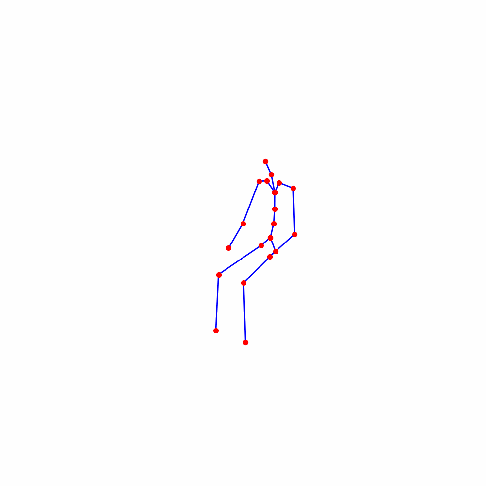
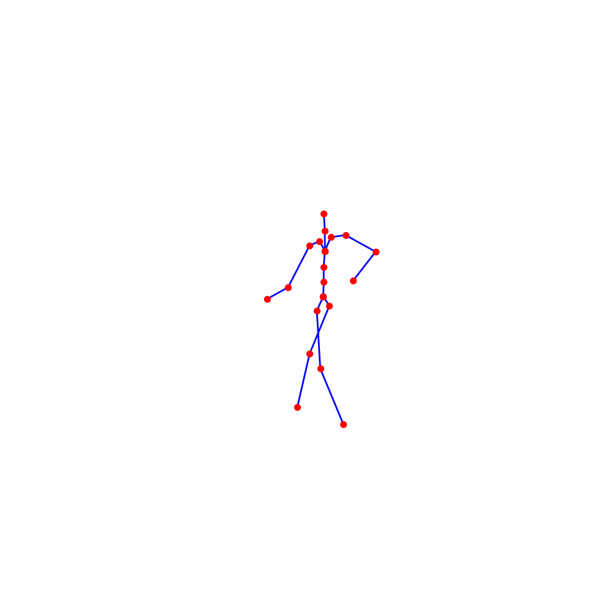

# MockAI Take-Home Assessment
This repository contains the implementation and evaluation of an MLP-based inversion method for motion generation using the MoDi architecture. 
Before running the train_mlp.py script, please ensure you have installed all dependencies and have teh pre-trained model files and data files within the /data directory as per the README_MoDi.md file.

## Using Pre-Trained Encoder

| Original Motion | Inversion Output |
|----------------|----------------|
|  |  |

| modified 20, 40, 60 in .npy | Inversion Output |
|----------------|----------------|
|  |  |

## Using Proposed MLP-based Inversion

| Original Motion | Inversion Output |
|----------------|----------------|
|  |  |

| modified 20, 40, 60 in .npy | Inversion Output |
|----------------|----------------|
|  |  |

## Overall Inverion performance of MLP

| Original Motion | Inversion Output |
|----------------|----------------|
|  |  |
|  |  |
|  |  |

## **Part 1: Motion Generation**

### **1. Are the generated motions temporally and spatially consistent?**
Yes, the generated motions maintain both **temporal and spatial consistency** when compared to the original input motion. The transitions between frames are smooth, and the spatial positions of key joints remain coherent across time steps, ensuring a natural-looking motion.

### **2. How do the regenerated motions compare to the manually modified motion? Are they close enough in keyframes?**
When the modified motion sequence is regenerated using the **inversion encoder**, the resulting motion **does not closely resemble the input motion or its keyframes**. The inversion process struggles to recover the exact modifications introduced manually, leading to discrepancies in the motion sequence. The keyframes at **frames 20, 40, and 60**—which were deliberately altered—do not retain their intended structure when reconstructed.

---

## **Part 2: Controllable Motion Generation with Inversion**

### **1. Are the results spatially and temporally consistent across frames?**
The results obtained using my **proposed inversion method** exhibit **spatial and temporal consistency** after a sufficient number of training iterations. 

- **During early training epochs**, the MLP struggles to generate temporally and spatially aligned motions as it is still learning the intermediate latent representations. The generated motions may contain distortions or unrealistic joint positions. 
- **As the loss decreases**, the generated motion sequences improve in quality, achieving a smoother and more natural progression of movements. 
- **However, in some cases**, even though the regenerated motion remains consistent, it does not always perfectly match the original motion sequence due to minor inaccuracies in intermediate latent vector estimation.

### **2. Are you satisfied with the quality of the motions generated? If not, suggest ways to improve them.**
The generated motions perform well for **simple sequences** like **standing with arms up** or **sitting positions**, where the motion complexity is relatively low. However, for **more intricate movements** such as **dancing or cat walking**, the model struggles to generate an accurate **intermediate motion vector (W+).** 

#### **Ways to Improve the Motion Quality:**
1. **Enhancing the Model Architecture:**
   - Instead of a simple **MLP**, a more advanced architecture such as a **Transformer-based network** could be employed to **capture the complex spatial-temporal dependencies in motion data**.
   - Introducing **attention mechanisms** within the MLP could also improve the encoding of long-range dependencies.

2. **Better Sampling Techniques for Training Data:**
   - **Truncated Normal Distribution:** Instead of random sampling from a Gaussian distribution, using a **truncated normal distribution** would allow for better coverage of diverse latent vectors, preventing extreme outliers.
   - **K-Means Clustering in Latent Space:** Selecting **latent vectors that are maximally distant** from each other in the latent space would help in covering a diverse range of motion styles, leading to better generalization.
   - **Diverse Motion Representation:** Instead of random sampling, employing **importance sampling** techniques can improve the quality of training data.

3. **Custom Loss Functions:**
   - The **standard MSE loss** may not fully capture perceptual motion quality. Adding a **combination of perceptual losses**, such as:
     - **Cosine Similarity Loss** to ensure similarity in feature space.
     - **Laplacian Pyramid Loss** for finer motion details.
     - **Temporal Smoothness Loss** to maintain motion continuity.

4. **Data Augmentation Techniques:**
   - **Velocity and Acceleration Constraints:** Training with additional **velocity** and **acceleration loss terms** can ensure smoother motion transitions.
   - **Joint-based Augmentation:** Introducing **random perturbations** in certain joint positions during training can improve robustness.

### **3. Explain why you chose this specific inversion approach. Discuss its advantages and limitations.**
#### **Approach Used:**
My inversion method involves **sampling random vectors from the intermediate vector space** and generating their corresponding motion sequences using the provided decoder. These generated pairs are then used to train an **MLP-based motion encoder** that learns to **infer the latent vector (W+) from a given motion sequence**.

#### **Advantages:**
1. **Real-Time Inference:**
   - Unlike **iterative optimization-based** methods, which require multiple forward passes, the trained **MLP can infer the latent vector instantly**.
   - This makes it suitable for **interactive applications** like real-time character animation.

2. **Flexibility to Extend the Model:**
   - The architecture allows for easy **integration of attention blocks** to improve latent space encoding (Initial implementation completed).
   - The framework can be extended to **incorporate additional constraints**, such as physics-based priors.

3. **Robustness to Noisy or Incomplete Motion Sequences:**
   - A well-trained MLP can infer meaningful latent vectors even when input motion sequences contain missing frames or minor inconsistencies.

#### **Limitations:**
1. **Requires a Large Paired Dataset:**
   - The MLP requires **a substantial dataset** of motion sequences paired with their corresponding latent vectors.
   - If the dataset is limited in diversity, the model may **fail to generalize to unseen motion styles**.

2. **Challenges in Latent Space Optimization:**
   - Unlike **optimization-based inversion**, which can iteratively refine the latent vector to minimize reconstruction error, our approach relies solely on the encoder’s ability to predict the correct **W+ vector** in a single pass.
   - This can sometimes lead to **imperfect reconstructions**.

3. **Loss Function Constraints:**
   - Standard loss functions like **MSE** might not fully capture **perceptual motion realism**, necessitating custom loss functions that align better with human perception.

### **4. The latent space of the model (representation space) is interpretable and allows for meaningful manipulation of the generated motions. How does the motion change as you interpolate between the original and inverted latent points?**
Interpolating between the **original motion vector (W) and its inverted latent representation (W')** results in **smooth transitions** between motion states. Ssome key observations include:

- **Spatial and Temporal Consistency:**  
  The interpolated motions retain overall **spatial integrity** and **temporal coherence**, meaning body parts move naturally between keyframes.

- **Artifact Introduction:**  
  Although the interpolation produces **plausible motion sequences**, certain **unnecessary joint movements** appear.
